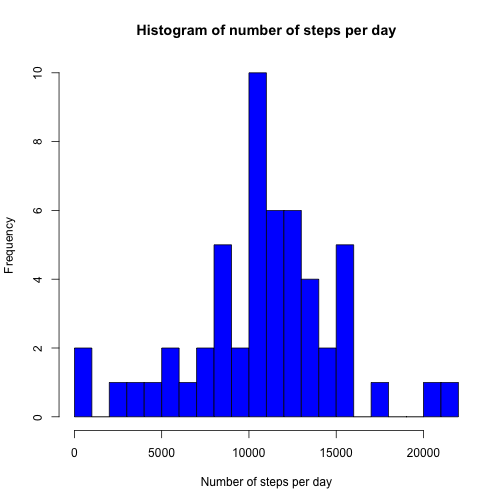
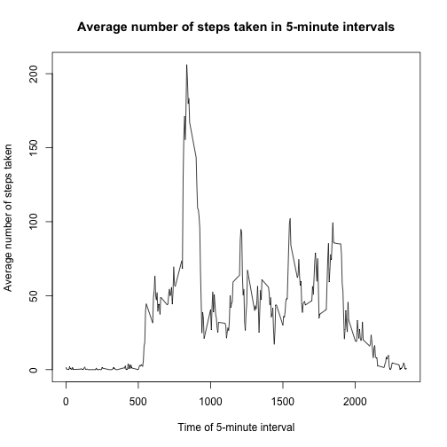
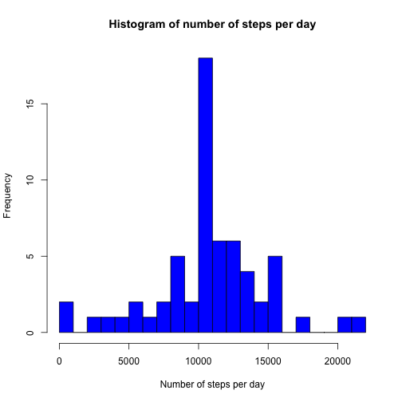
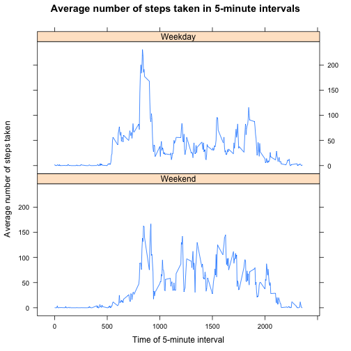

## Loading and preprocessing the data

```r
#---- Read the data and reformat dates
csvData <- read.csv("activity.csv")
csvData$date <- as.character(csvData$date)
```

## What is mean total number of steps taken per day?

```r
#---- Remove NAs and calculate total steps per day
csvData_noNAs  <- csvData[!is.na(csvData$steps),]
sumSteps       <- tapply(csvData_noNAs$steps,csvData_noNAs$date,sum)
#---- Draw the histogram
hist(sumSteps,breaks=20,col="blue",
     xlab="Number of steps per day",
     main="Histogram of number of steps per day")
```



* The mean number of steps per day is 1.0766189 &times; 10<sup>4</sup>.  
* The median number of steps per day is 10765.

## What is the average daily activity pattern?


```r
meanSteps <- tapply(csvData_noNAs$steps,csvData_noNAs$interval,mean)
plot(as.numeric(names(meanSteps)),meanSteps,type = "l",
     xlab="Time of 5-minute interval",
     ylab="Average number of steps taken",
     main="Average number of steps taken in 5-minute intervals")
```



* The 104th interval (time = 835) has the highest average number of steps (206.1698113).

## Inputing missing values
* There are 2304 missing values.


```r
csvData_NAs       <- csvData[is.na(csvData$steps),]
csvData_NAs$steps <- meanSteps[as.character(csvData_NAs$interval)]
csvData_patched   <- rbind(csvData_NAs,csvData_noNAs)

sumSteps2 <- tapply(csvData_patched$steps,csvData_patched$date,sum)
#---- Draw the histogram
hist(sumSteps2,breaks=20,col="blue",
     xlab="Number of steps per day",
     main="Histogram of number of steps per day")
```



After replacing missing values of "steps" with the mean value of the respective interval:  

* The mean number of steps per day is 1.0766189 &times; 10<sup>4</sup>.  
* The median number of steps per day is 1.0766189 &times; 10<sup>4</sup>.

The result of the procedure (that I have used) to replace the missing values is to cause a large number of days to have the mean value 1.0766189 &times; 10<sup>4</sup>, as can be seen in the histogram. This value is also the median value for this procedure. One could conclude that this isn't the best method for dealing with missing values, as it biases the distribution in this way.

## Are there differences in activity patterns between weekdays and weekends?

```r
#---- Add weekend variable
csvData_patched$weekEnd <- ifelse(weekdays(as.POSIXlt(csvData_patched$date),
                                           abbreviate = TRUE) 
                                  %in% c("Sat","Sun"),"Weekend","Weekday")
#---- Calculate the mean
meanSteps <- aggregate(csvData_patched$steps, 
                       list(interval = csvData_patched$interval, 
                            weekEnd = csvData_patched$weekEnd), 
                       FUN = "mean")
#---- Plot weekend and weekday seperately
lattice::xyplot(x~interval|weekEnd,
                meanSteps,type = "l",
                xlab="Time of 5-minute interval",
                ylab="Average number of steps taken",
                main="Average number of steps taken in 5-minute intervals",
                layout=c(1,2),
                index.cond=list(2:1))
```



